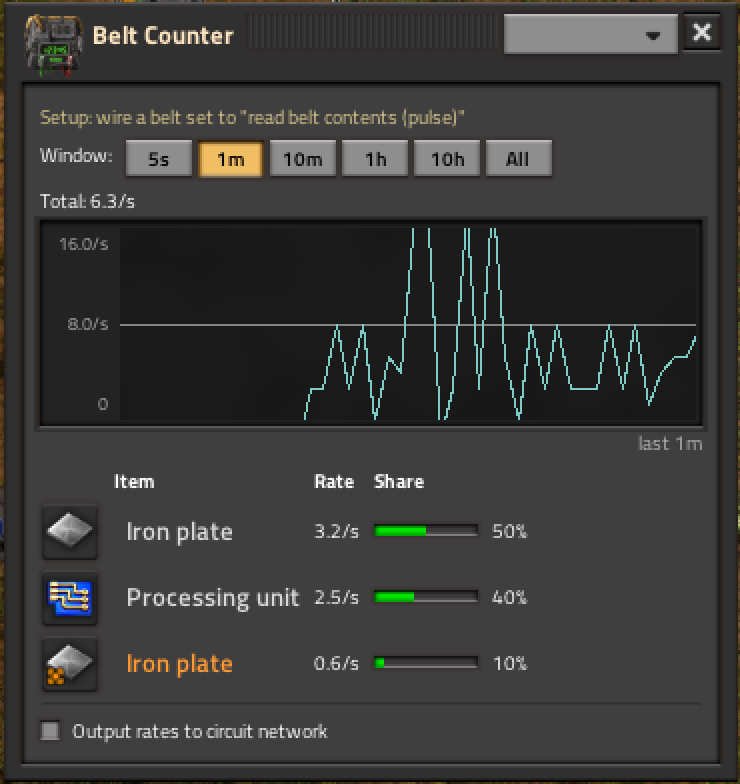
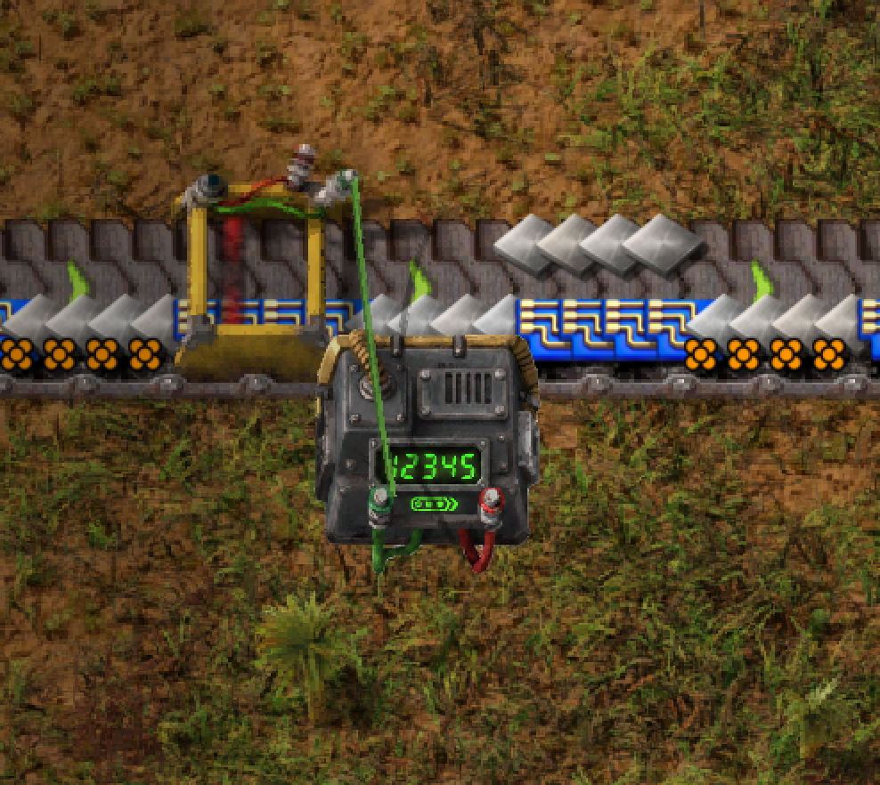

# Belt Counter

A Factorio **2.0 / Space Age** mod that adds a combinator-style building, the
**Belt Counter**, which measures item **throughput over time** on a belt and
breaks it down **by quality**.

## Screenshots

Click the building to open a live readout: a line graph over the selected time
window, plus a per-item, per-quality rate table. Click an item to focus the
graph on it.



Wired to a belt set to "read belt contents (pulse)":



## Concept

- Place a Belt Counter building (looks/feels like a combinator).
- Wire it to a transport belt using the normal circuit wire, with the belt set
  to **read belt contents → pulse**. Each item that moves onto the belt emits a
  one-tick pulse; the counter accumulates those pulses.
- Because 2.0 circuit signals carry **quality**, the counter tracks counts
  per item *and* per quality level (normal / uncommon / rare / epic / legendary).

## Features

- **GUI graph** — click the building to open a panel showing items/min over a
  rolling time window, broken down by quality.
- **Circuit output** — the building also emits the measured rate(s) as circuit
  signals you can wire to lamps / displays.

## Status

Early scaffold. See `DESIGN.md` notes inline below and the `tools/` scripts.

## Layout

```
info.json              mod manifest
data.lua               prototype stage entry (loads prototypes/*)
control.lua            runtime stage entry (loads scripts/*)
prototypes/            entity / item / recipe / technology definitions
scripts/               runtime logic (counting, GUI, circuit output)
graphics/              sprites & icons (generated via tools/gen_assets.py)
locale/en/             strings
tools/                 dev tooling (deploy symlink, asset generation)
```

## Dev workflow

1. `tools/deploy.sh` — symlinks this repo into the Factorio `mods/` folder so
   changes are picked up on game restart (or `/c game.reload_mods()` where
   supported).
2. Launch Factorio 2.0 with Space Age, enable "Belt Counter" in Mods.
3. Iterate; check `factorio-current.log` for load errors.

## Requirements

- Factorio **2.0+**
- **Space Age** (for the `quality` mod) — the quality breakdown degrades
  gracefully to item-only counting if `quality` is not present.
